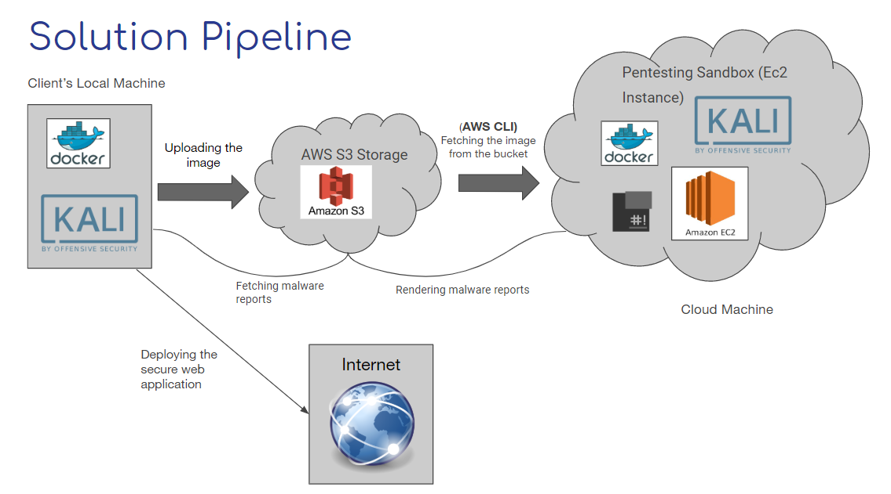

# Secure PenBox

Secure PenBox:
A sandboxed penetration testing environment that lets the user upload an image of their web application and conducts standard vulnerability assessments using a predefined set of enumeration tools and presents the results in a report.
Used the Aws Ec2 cloud service to produce a sandboxed Kali Linux environment, synced it with the S3 storage service to import a docker image of a test web application to the ec2 instance, used a bash script for enumeration and vulnerability assessment and exported the reports back to the user via an endpoint.   
This project allows developers to test and assess their web applications for different bugs, vulnerabilities and loopholes before pushing their secure and bug free product to the internet.


## Work Flow for the Secure PenBox




### Prerequisites

Things you need to have pre-installed.

```
Have Kali Linux Pre-Installed 

Have Docker Pre-Installed 

To Upload the Web Application Docker Image to the AWS S3 Bucket through your client machine: 

Required Libraries: 
Angular JS
AWS Javascript SDK 

or

Upload the Image through the Python Script. 

```

### Installing and Uploading

For Uploading a Web App Image through the Application  
Start a new shell, run the Python HTTP Server
```
sudo ./start_server.sh
```
Access the Application through //localhost:8000

Put in the necessary details such as 
Access Key
Secret Key 
Bucket Name
& 
Upload the Image to the particular s3 Bucket. 

OR

Upload the Web App Image through the Python Script. 
```
python upload_dir.py
```


## Running the tests on the Web Application on the Cloud. 


